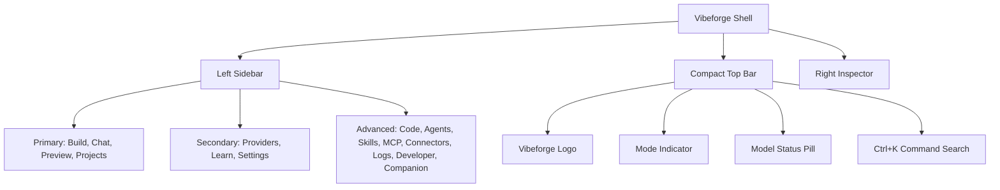

# Vibeforge Guided No-Code Builder Plan

This document outlines the product strategy and architectural blueprints for transforming Vibeforge into a guided no-code builder.

## Core Vision
Vibeforge is designed to lower the barrier to software creation by guiding non-programmers from their initial ideas to fully functional, live-running prototypes. 

- **No Tech Jargon:** Technical terms like "Vite", "React", "IPC", or "MCP" are hidden behind an "Advanced" settings panel.
- **Goal-Oriented:** Users construct their app layout and requirements step-by-step.
- **Immediate Feedback:** Selecting options compiles a rich developer-level prompt that auto-starts a live-updating server.

---

## Workspace Layout Simplification

### 1. GoalWizard Steps
1. **Build Type Selection:** Visual example cards for Website, Landing Page, Web App, Android App, etc.
2. **Purpose Selection:** Define if it's for business, personal, school, or experimental use.
3. **Feature Selector:** Click list of interactive modules (forms, local storage, mobile layout, dark/light mode toggle).
4. **Style Picker:** Choose visual design profiles (Ivory Premium, Codex Calm, Emergent Clean).
5. **Brief Preview:** Show compiled prompt in copyable console block.
6. **Build with Preview:** Primary CTA that redirects to `/preview` and boots the live compiler.

### 2. Next Step Suggestions
Once a build completes, the AI suggests plain-language improvements:
- *Add a contact form*
- *Enable dark mode switch*
- *Make cards interactive*

---

## E2E Validation Flow
The E2E tests in `tests/e2e/20-vibeforge-no-code-wizard.spec.ts` simulate:
1. Navigating to the Build Wizard.
2. Walking through the steps.
3. Confirming prompt compiler structure.
4. Launching the preview pipeline successfully.
