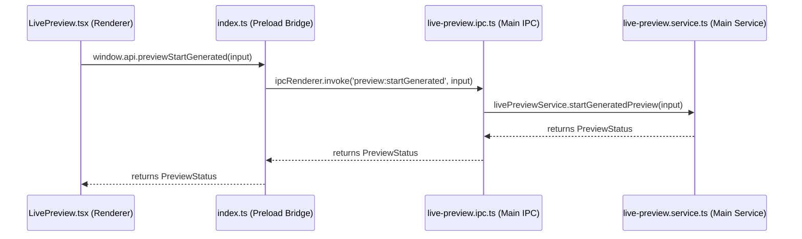

# LivePreview Runtime Audit — Aureon Desk

This document outlines the architectural components, IPC channels, sandbox layouts, and rendering mechanics of the LivePreview system in Aureon Desk.

---

## 1. Process Communication & IPC Bridge

The communication path between the React renderer process (Chrome window) and the main process (Node.js/Electron) for sandboxed previewing is bridged through the preload script.



---

### Preload Bridge

Exposed methods inside `src/preload/index.ts` include:

- `previewStart(sandboxPath, port)`: Invokes `preview:start`
- `previewStop()`: Invokes `preview:stop`
- `previewStatus()`: Invokes `preview:status`
- `previewWriteFile(sandboxPath, relativePath, content)`: Invokes `preview:writeFile`
- `previewCreateDemo(port, style)`: Invokes `preview:createDemo`
- `previewStartGenerated(input)`: Invokes `preview:startGenerated` [NEW]

---

## 2. Sandbox Filesystem & Directories

- **Sandbox Root Path:** `app.getPath('userData')/preview-sandbox/`
  - In production (Windows): `%APPDATA%/aureon-desk/preview-sandbox/`
  - In development: `C:/Users/mertg/AppData/Roaming/aureon-desk/preview-sandbox/`
- **Active Sandbox Directory:** A subfolder named with a unique v4 UUID (e.g. `.../preview-sandbox/d283af90-2c70-496a-8b83-500b99ac8f25/`) is generated per preview session.
- **Vite React Template:** Generates `package.json`, `vite.config.ts`, `index.html`, and `src/main.tsx`. Run `npm install` and spawn `npx vite --host 127.0.0.1` locally.
- **HTML / Demo Template:** Instantly writes a single static `index.html` file (along with an internal marker `.aureon-demo` for self-test identification).

---

## 3. Local Preview Server & Ports

- **Host Binding:** Always bound locally to `127.0.0.1` (never exposed to external local network interfaces like `0.0.0.0` or public IPs for security).
- **Port Discovery:** Scans ports starting from `3100` dynamically via `findAvailablePort` to locate an open TCP port.
- **Preview Server Types:**
  1. **Vite Server:** Spawned as a child process: `npx vite --host 127.0.0.1 --port {actualPort}`.
  2. **Static Server:** In-process Node.js `http.createServer` serving static file assets from the sandbox path on the resolved local port.
- **Returned Preview URL:** `http://127.0.0.1:{actualPort}`

---

## 4. Renderer Iframe Render & State Synchronization

- **Component:** [LivePreview.tsx](file:///C:/Users/mertg/Desktop/code/src/renderer/src/pages/LivePreview.tsx)
- **Render Trigger:** The preview panel uses an `<iframe>` centered in the right column:

  ```tsx
  {status.status === 'running' && status.url && (
    <iframe src={status.url} title="Aureon Live Sandbox Preview" />
  )}
  ```

- **State Synchronization:**
  - The renderer polls the status every 2 seconds via `api.previewStatus()`.
  - Background logs are buffered in `_session.logs` (limited to 100 entries) and rendered dynamically inside the Server Logs Console.
  - Stopped/Error states reset session variables and tear down active servers.

---

## 5. Root Cause Analysis: Studio Auto-Popup Failure

Previously, when the user chose "Generate + Preview" in Aureon Studio, the flow failed to render automatically because:

1. **Lack of Integration Flow:** The Studio page only routed the navigation to `/preview` (Code Mode) but did not pass any execution metadata or auto-trigger context.
2. **Missing Initialization Hooks:** The `LivePreview.tsx` page mounted in a clean, idle state. It had no knowledge that it was routed from a Build App card action, requiring the user to manually click the "Run Coding Demo App" or "Start Server" buttons.
3. **No Dynamic Theme Propagation:** The main process service only supported a static counter HTML preset, preventing the wizard's chosen style (teal, slate, etc.) from styling the generated output.
4. **No-op Error State:** Compilation and start-up errors were captured in state but never rendered in the UI, resulting in silent failures when a port was blocked or file writes failed.
