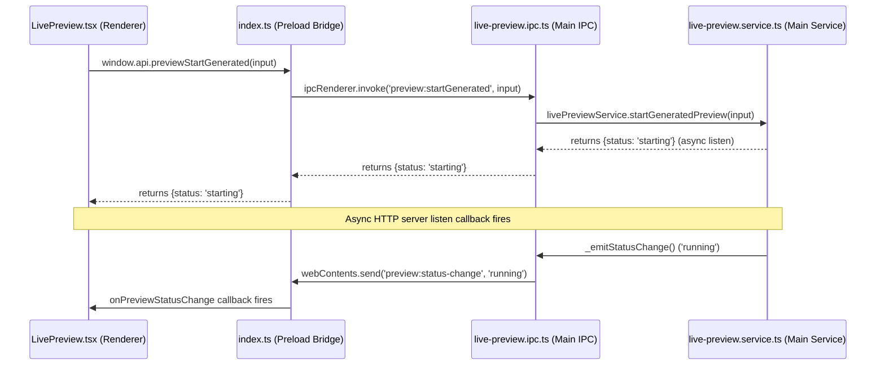

# LivePreview Runtime Audit — Vibeforge

This document outlines the architectural components, IPC channels, sandbox layouts, and rendering mechanics of the LivePreview system in Vibeforge.

---

## 1. Process Communication & IPC Bridge

The communication path between the React renderer process (Chrome window) and the main process (Node.js/Electron) for sandboxed previewing is bridged through the preload script.



---

### Preload Bridge

Exposed methods inside `src/preload/index.ts` include:

- `previewStart(sandboxPath, port)`: Invokes `preview:start`
- `previewStop()`: Invokes `preview:stop`
- `previewStatus()`: Invokes `preview:status`
- `previewWriteFile(sandboxPath, relativePath, content)`: Invokes `preview:writeFile`
- `previewCreateDemo(port, style)`: Invokes `preview:createDemo`
- `previewStartGenerated(input)`: Invokes `preview:startGenerated`
- `onPreviewStatusChange(callback)`: Registers listener for `preview:status-change` IPC push events

---

## 2. Sandbox Filesystem & Directories

- **Sandbox Root Path:** `app.getPath('userData')/preview-sandbox/`
  - In production (Windows): `%APPDATA%/Vibeforge-desk/preview-sandbox/`
  - In development: `C:/Users/mertg/AppData/Roaming/Vibeforge-desk/preview-sandbox/`
- **Active Sandbox Directory:** A subfolder named with a unique v4 UUID (e.g. `.../preview-sandbox/d283af90-2c70-496a-8b83-500b99ac8f25/`) is generated per preview session.
- **Vite React Template:** Generates `package.json`, `vite.config.ts`, `index.html`, and `src/main.tsx`. Run `npm install` and spawn `npx vite --host 127.0.0.1` locally.
- **HTML / Demo Template:** Instantly writes a single static `index.html` file (along with an internal marker `.Vibeforge-demo` for self-test identification).

---

## 3. Local Preview Server & Ports

- **Host Binding:** Always bound locally to `127.0.0.1` (never exposed to external local network interfaces like `0.0.0.0` or public IPs for security).
- **Port Discovery:** Scans ports starting from `3100` dynamically via `findAvailablePort` to locate an open TCP port.
- **Preview Server Types:**
  1. **Vite Server:** Spawned as a child process: `npx vite --host 127.0.0.1 --port {actualPort}`.
  2. **Static Server:** In-process Node.js `http.createServer` serving static file assets from the sandbox path on the resolved local port.
- **Returned Preview URL:** `http://127.0.0.1:{actualPort}`

---

## 4. Renderer Iframe Render & State Synchronization

- **Component:** [LivePreview.tsx](file:///C:/Users/mertg/Desktop/code/src/renderer/src/pages/LivePreview.tsx)
- **Render Trigger:** The preview panel uses an `<iframe>` centered in the right column:

  ```tsx
  {status.status === 'running' && status.url && (
    <iframe src={status.url} title="Vibeforge Live Sandbox Preview" />
  )}
  ```

- **State Synchronization:**
  - The renderer subscribes to immediate IPC push events (`onPreviewStatusChange`) eliminating the 2-second delay.
  - A fast 200ms short-poll runs for the first 5 seconds after a compilation request as a fallback.
  - A slow 2-second background poll ensures resilience if IPC events are missed.
  - Background logs are buffered in `_session.logs` (limited to 100 entries) and rendered dynamically inside the Server Logs Console.
  - Stopped/Error states reset session variables and tear down active servers.

---

## 5. Root Cause Analysis: Studio Auto-Popup Failure (Fixed)

Previously, when the user chose "Generate + Preview" in Vibeforge Studio, the iframe failed to render immediately because:

1. **Async Node.js API:** `livePreviewService.startPreview()` calls `http.createServer().listen()`, which fires its callback asynchronously.
2. **Premature Status Return:** The IPC handler returned immediately with `{status: 'starting'}` before the callback could set the status to `running`.
3. **Poll Delay:** The renderer waited for its next 2-second poll interval before checking the status again, creating an artificial 2-second blank screen.

### The Fix

1. **Push Mechanism:** The main process now fires a `preview:status-change` IPC event to all windows when the server enters `running` or `error` state.
2. **Renderer Subscription:** The React component subscribes via `useEffect` and updates state immediately—**zero delay**.
3. **Fast-Poll Fallback:** An aggressive 200ms poll runs for 5 seconds after `handleRunDemo()` resolves as a belt-and-suspenders fallback for incredibly fast compilation cycles.
